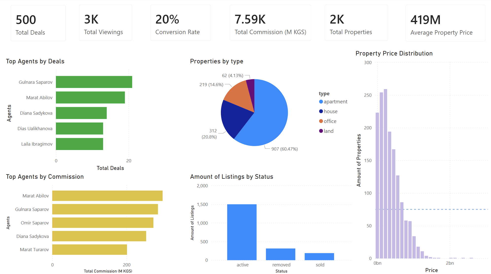

# Real Estate SQL Analysis

## 📌 Project Overview
This project analyzes a real estate dataset including agents, clients, properties, listings, viewings, and deals.  
The goal is to **explore the data, calculate performance metrics, and generate actionable insights** for a real estate business.  

Key objectives:
- Understand agent performance and efficiency  
- Analyze property pricing and popularity  
- Calculate conversion rates from viewings to deals  
- Determine revenue per agent  
- Identify top properties and clients  

---

## 🗄 Dataset Description
The dataset contains six main tables:

| Table        | Description |
|--------------|-------------|
| `agents`     | Agent details: name, experience years, etc. |
| `clients`    | Client information: type (buyer/seller), contact details |
| `properties` | Property details: type, price, area, location |
| `listings`   | Properties listed by agents |
| `viewings`   | Records of property viewings by clients |
| `deals`      | Completed transactions including agent commission |

---

## 🔍 Analysis Overview
The project contains the following sections:

1. **Data Exploration**
   - Inspect tables and basic statistics  
   - Check duplicates and unique values  
   - Aggregate counts and averages for properties, listings, and viewings  

2. **Agent Performance**
   - Deals per agent  
   - Viewings per agent and per listing  
   - Agent efficiency: conversion rate from viewings to deals  
   - Agent revenue ranking  

3. **Property Analysis**
   - Properties with completed deals  
   - Properties above the average price  
   - Top 10 most expensive properties  

4. **Experience & Segmentation**
   - Categorize agents as `junior` or `senior` based on experience  
   - Count agents per category  

5. **Conversion & Revenue**
   - Calculate conversion rate (viewings → deals)  
   - Determine total commission per agent  

---

## 📊 Key Insights
- **Top Agents**: Some agents generate more deals per viewing, showing higher efficiency.  
- **Property Pricing**: A small subset of properties is significantly above average price, driving most agent revenue.  
- **Conversion Rate**: Overall conversion rate of viewings to deals indicates business performance efficiency.  
- **Agent Revenue**: Senior agents tend to have higher total commission, but some junior agents have high conversion rates.  

---

## 💻 SQL Techniques Used
- `SELECT`, `JOIN`, `LEFT JOIN` for table relationships  
- Aggregations: `COUNT`, `AVG`, `MIN`, `MAX`  
- Grouping: `GROUP BY`  
- Window functions: `COUNT(*) OVER (PARTITION BY ...)`  
- Common Table Expressions (CTE)  
- Filtering with `WHERE` and subqueries
- Ordering with `ORDER BY` and limiting results with `LIMIT`

## Repository Structure

- `data/` – contains CSV files for each table:
  - `agents.csv`
  - `clients.csv`
  - `properties.csv`
  - `listings.csv`
  - `viewings.csv`
  - `deals.csv`

- `queries/` – contains SQL analysis queries  
  - `real_estate_analysis.sql`

- `dashboard/` – contains the Power BI dashboard file  
  - `real_estate_dashboard.pbix`

- `images/` – contains project visuals  
  - `dashboard.png`

- `README.md` – project description and instructions
  
## 💻 How to Run
1. Import all CSV files from `data/` into your SQL database.
2. Open `queries/real_estate_analysis.sql` in your SQL client.
3. Execute the queries to analyze:
   - Agent performance
   - Conversion rates
   - Top properties
   - Revenue per agent
   - Other insights
  
## Power BI Dashboard

